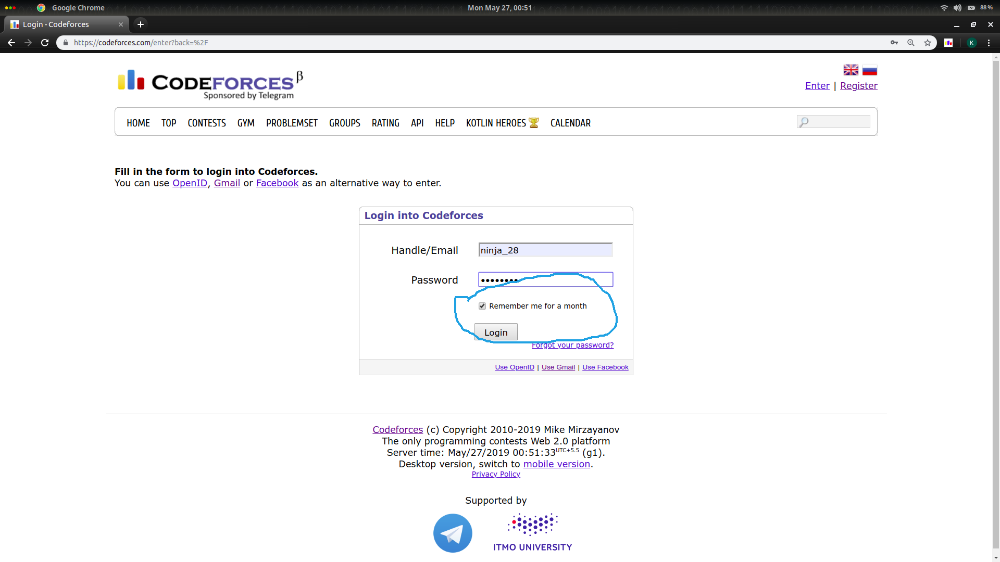

# CODEFORCES_SUBMIT
This is a script to automatically submit codes for codeforces problems only with  one click of running the script.:relaxed:
I made this script because it seems to boring to me to select file of my code by going to that folder through dropdown menu.:stuck_out_tongue_winking_eye:

## Pre-requisite


## Usage

### For first time users
For first time users , initially you have to run the script 'starter_script.py' given above.Run it using the command (in your terminal) :-  
jj

```bash
python3 starter_script.py
```

Then a webpage of codeforces will open. Please login in it and do tick the column of **remember me for month** given in codeforces, so that everytime you run the script to submit you code you not have to login always.


**The script for submission will work only if you are already login**

## To submit your code
Open the code and you will see language variable in it and there are all options for language below it itself in the code. Please copy the one you want to select and paste in the language variable where there is **language = "GNU G++17 7.3.0"**
eg. If you want to select python language then it should be like **language = "Python 3.7.2".  

*By default I have it is already selected as C++ so incase you want to submit in C++ no need to change it*

Now simply run the script by command:-
```bash
python3 script.py
```
It will ask you for problem code no  
 eg : if problem is 1167G type 1167G  
 
 And then you will be asked relative path of your code from current directory.  
 eg. If your code is in the same directory from where you are running this script then simply input code no eg.1167G.cpp  
 
 *In this script I have mentioned link for problems opened through problemset i.e having link like 'https://codeforces.com/problemset/problem/1167/G' , If you want it to submit for other links like in contest then you can change the link in code in line 'driver.get('write you link here for the problem')'*

And now simply press enter and see the magic :satisfied:.


